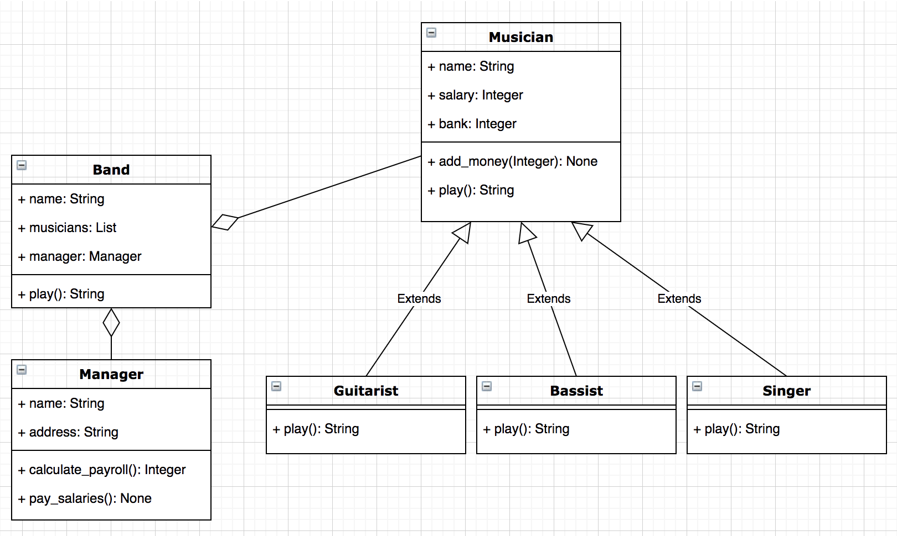

# Composition Lab

## Learning Objectives

- Practice interpreting a class diagram
- Build on your understanding of how objects interact with each other
- Build on your TDD skills

A Band is an aggregation of musicians. This might be a Singer, Guitarist, Bassist, Manager etc. We would say a Band __HAS A__ Guitarist. 

Consider the following diagram:



### Explanation

Our diagram shows 3 classes inheriting from **Musician**. They all override the **play()** method. Our **Band** class has a reference to a List of Musician objects and also has a Manager object.

Our **Band** is composed of these other objects (Musicians and Manager). The **Band** class is responsible for calculating salaries and paying the musicians. However, the band object passes this responsibility off to the **Manager** object. (see the Car class **start()** method for a similar example)

## MVP

- Using the class diagram above, your task is to get the test suite to pass. You will need to create 6 classes in total.
- Use the error message to guide you.

## Running the code

Make sure you are working in the start_point directory.

```
python3 run_tests.py
```

## Extension

Come up with your own example of composition in Python and draw the class diagram (you can use software such as https://app.diagrams.net or pen and paper). If you have time, you can write the Python code for your example (don't worry about tests). 

